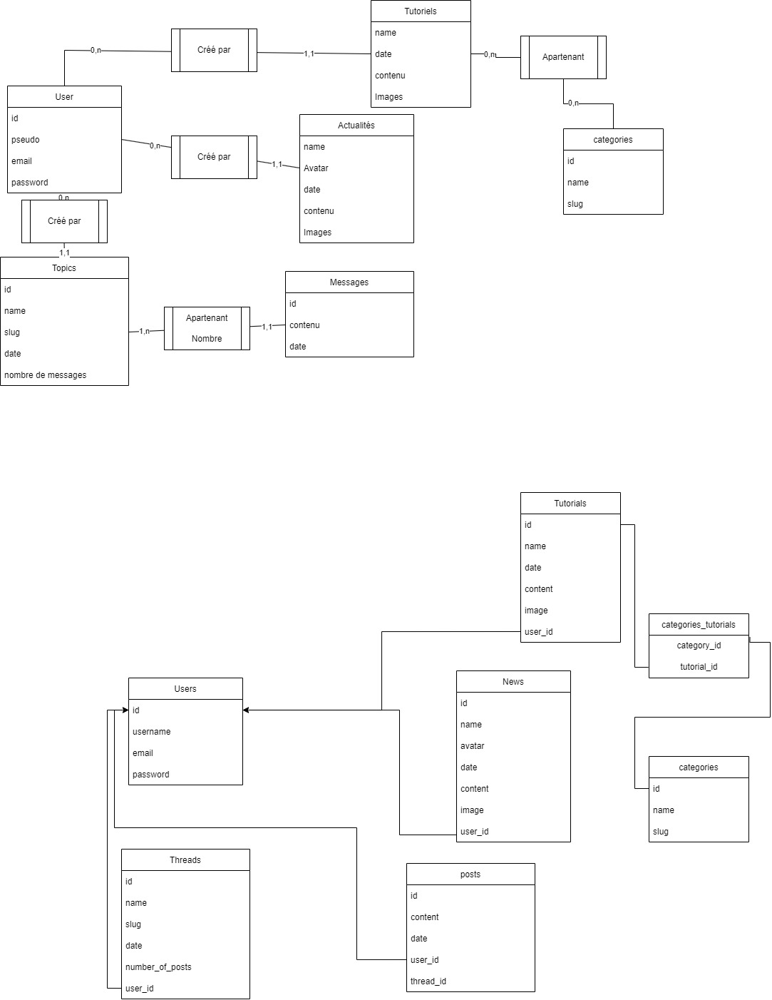

# L'objectif est de créer le site internet de Bascode.

## LAUNCH DEV SERVER APP

` cd app/`
` php -S localhost:8000 -t public`

## TO CLONE REPO

Requirements: PHP8.1 + APCU Cache + Mysql WITH User bascode and DB Bascode

` git clone https://github.com/BascodeFR/bascode.fr.git `
` cd bascode.fr/app/ `
` composer install --ignore-platform-reqs `
` ./vendor\bin\phinx migrate `
` php -S localhost:8000 -t public `

## Avant de Commit

`  .\vendor\bin\phpcs`
`  .\vendor\bin\phpcbf`
` .\vendor\bin\phpunit`  

Tips pour les logs git
` git log --all --decorate --oneline --graph `

### pour le contenu des actualités

{{ content | nl2br | excerpt}}

### BDD

# Idée de mise à jour : 
- intégration 3d avec Spline

